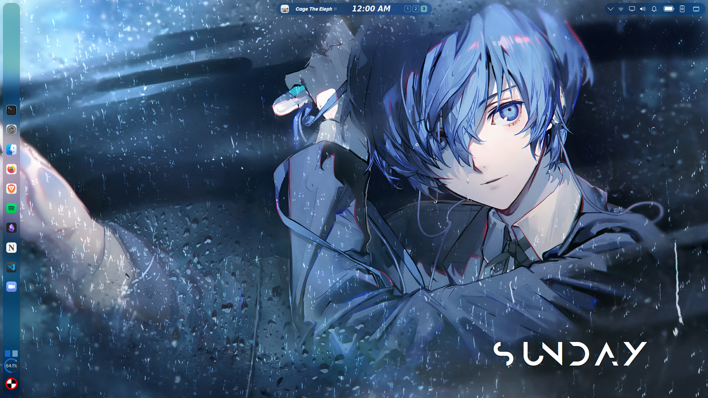
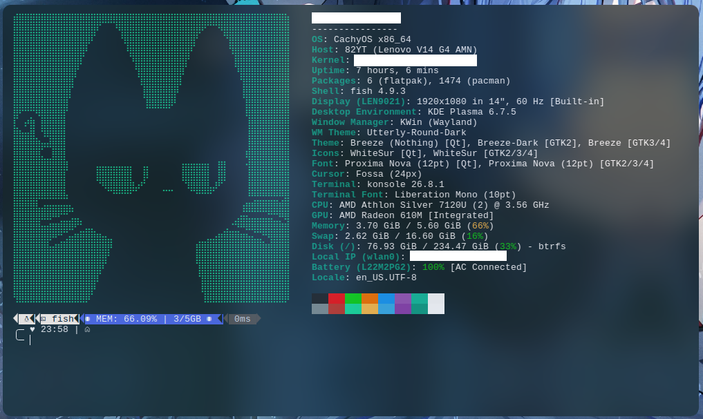

## Preview



Personal KDE Plasma desktop configuration running on CachyOS.
No install script — this repo is a manual reference. Copy the files you want to
their target locations as listed below.

## Terminal Preview



### Install Required Programs

These must be installed before the config files will work correctly.

```bash
sudo pacman -S fish fastfetch konsole
```

install Oh My Posh:

```bash
curl -s https://ohmyposh.dev/install.sh | bash -s
```

For other distros, install from source:

| Program    | Source                                               |
| ---------- | ---------------------------------------------------- |
| Fish shell | [fishshell.com](https://fishshell.com/)              |
| Fastfetch  | [GitHub](https://github.com/fastfetch-cli/fastfetch) |
| Oh My Posh | [ohmyposh.dev](https://ohmyposh.dev/)                |
| Konsole    | Ships with KDE Plasma                                |

### Install Required Themes (KDE Store)

These are not bundled in this repo and must be installed through System Settings:

| Component         | Name               | Where to install                                                 |
| ----------------- | ------------------ | ---------------------------------------------------------------- |
| Icon Theme        | WhiteSur           | System Settings > Icons > Get New Icons                          |
| Window Decoration | Utterly-Round-Dark | System Settings > Window Management > Window Decorations         |
| Font              | Proxima Nova       | Commercial font — install manually then it will be auto-detected |

### Copy Config Files

```bash
git clone https://github.com/Threeguana/dotfiles
mkdir ~/dotfiles
cd ~/dotfiles

# Fish shell
cp fish/config.fish ~/.config/fish/config.fish

# Konsole
cp konsole/profile ~/.local/share/konsole/
cp konsole/Breeze.colorscheme ~/.local/share/konsole/

# KDE global settings
cp kdeglobals ~/.config/kdeglobals

# Sound themes
cp -r sounds/Blue_Archive_sounds ~/.local/share/sounds/

# Fastfetch ASCII logo
cp ascii-art.txt ~/ascii-art.txt
```

**Disclaimer**:
I am not the creator of these sound. All rights to the sounds belong to the original artists of the game.
Log out and back in to apply the KDE global settings.

---

### KDE Config Files

| File         | Target                 | What it controls                        |
| ------------ | ---------------------- | --------------------------------------- |
| `kdeglobals` | `~/.config/kdeglobals` | Colors, fonts, accent color, icon theme |

### Konsole

| File                         | Target                                     | What it controls              |
| ---------------------------- | ------------------------------------------ | ----------------------------- |
| `konsole/profile`            | `~/.local/share/konsole/Profile 1.profile` | Terminal behavior and margins |
| `konsole/Breeze.colorscheme` | `~/.local/share/konsole/`                  | Terminal color palette + blur |

The color scheme has background blur enabled (`Blur=true`, `Opacity=0.8`). This
requires the **Blur** desktop effect to be active in System Settings > Desktop Effects.

### Fish Shell

| File               | Target                       | What it controls            |
| ------------------ | ---------------------------- | --------------------------- |
| `fish/config.fish` | `~/.config/fish/config.fish` | Prompt, greeting, fastfetch |

The config sources the base CachyOS Fish config, then loads the Oh My Posh
prompt and runs Fastfetch with the custom ASCII logo on every shell start.

### Wallpapers

The `wp/` folder contains live wallpaper video files. They require either:

- [Wallpaper Engine (Steam)](https://store.steampowered.com/app/431960/)
- A KDE Plasma smart video wallpaper plugin

The wallpaper files are not managed by any script — point your wallpaper tool at
the `wp/` folder and pick from there.

### Blur / Glassmorphism Effect

The Konsole color scheme has transparency and blur enabled. This is a **KWin
compositor feature**, not a file you can copy. To get the same effect:

1. System Settings > Desktop Effects > enable **Blur**
2. Optionally install [`glass-effects`](https://github.com/4v3ngR/Glass)
   for extended blur controls (refraction, tinting, noise)

### Widget

All the widget i use.
This is a built-in KDE Plasma widget.

| Widget                 |
| ---------------------- |
| Modern Clock           |
| Playmusic Toolbar      |
| Box Pager              |
| McOs BS Inline Battery |

**PS:**
Sorry for messy documentation. Hope this works idk :P
